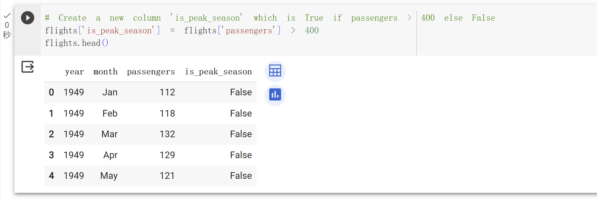

# IDS706_MiniProj9_YangXu
# Cloud-Hosted Notebook Data Manipulation

## Requirements:
1. Set up a cloud-hosted Jupyter Notebook (e.g., Google Colab).
2. Perform data manipulation tasks on a sample dataset.

## Grading Criteria:
- **Setup and configuration (20 points)**
- **Data manipulation tasks (20 points)**

## Deliverables:
- Link to the cloud-hosted notebook.
- Document demonstrating the tasks performed.

---

## Link to the Notebook:
[Google Colab Notebook](https://colab.research.google.com/drive/1QTL-9692wflyE_5fZWD1uHWNgIioqPA9)

---

## Project Implementation:

### Setup and Configuration:

#### Using Google Colab:
1. Go to [Google Colab](https://colab.research.google.com/).
2. Sign in with your Google account.
3. Click on 'NEW NOTEBOOK' to create a new Jupyter notebook.

---

### Data Manipulation:

#### Importing Libraries:
```python
import pandas as pd
import numpy as np
```

For demonstration purposes, we use a sample dataset from the seaborn library. This dataset contains data about different flights.<br>

#### Installation and Data Loading:
To perform data manipulation and visualization, we need certain Python libraries that provide us with the tools and data structures required. In our case, we're using the `pandas` library for data manipulation and `seaborn` for accessing sample datasets.

1. Library Installation:
```python
!pip install seaborn
```

The above code installs the seaborn library. The `!` at the beginning is used in Jupyter-like environments to execute shell commands. We utilize pip, a package manager for Python, to install seaborn.


2. Data Loading:

```python
import seaborn as sns

# Load flights dataset
flights = sns.load_dataset('flights')
flights.head()
```

Here, we import the seaborn library and then use its `load_dataset` function to fetch the 'flights' dataset. The `.head()` method from the pandas DataFrame is used to display the first five rows of the dataset, giving us a glimpse of the data we are going to work with.


#### Tasks:
1. Filtering:
Filtering is the process of selecting specific rows from a dataset based on certain criteria.
```python
# Filter flights data for the year 1950
flights_1950 = flights[flights['year'] == 1950]
flights_1950
```
In this task, we filtered the flights dataset to get only the entries from the year 1950. The result is stored in the `flights_1950` DataFrame.


2. Aggregation:
Aggregation involves combining multiple rows of data into a single result, typically using functions like sum, average, or count.
```python
# Aggregate total passengers by year
total_passengers_by_year = flights.groupby('year').sum().reset_index()
total_passengers_by_year
```
Here, we used the `.groupby()` method to group the dataset by the 'year' column. Then, the `.sum()` method aggregates the total passengers for each year. Finally, `.reset_index()` ensures the year remains as a column and not an index.


3. Pivot Table:
Pivot tables are used to reorganize and summarize data in a table format, especially when you want to view relationships between two variables.
```python
# Pivot the table to show months in the rows and years in the columns with passengers as values
flights_pivot = flights.pivot("month", "year", "passengers")
flights_pivot
```
With this task, the dataset is transformed into a pivot table with 'month' as rows, 'year' as columns, and the number of 'passengers' as the cell values.


4. Transformation:
Data transformation involves creating new columns or modifying existing ones based on some logic or function.
```python
# Create a new column 'is_peak_season' which is True if passengers > 400 else False
flights['is_peak_season'] = flights['passengers'] > 400
flights.head()
```
In this task, a new column called 'is_peak_season' is created. For each row in the dataset, if the number of passengers is greater than 400, the value for 'is_peak_season' will be True; otherwise, it will be False.


5. Handling Missing Values:
Handling missing values is a critical step in data preprocessing. It involves deciding how to treat rows or columns that have missing or NaN values.
```python
# Introduce NaN values
flights.loc[1:5, 'passengers'] = np.NaN

# Handle NaN values by filling them with the mean
flights['passengers'].fillna(flights['passengers'].mean(), inplace=True)
flights.head(10)
```
For demonstration purposes, we intentionally introduce NaN values into the 'passengers' column. Subsequently, these NaN values are replaced with the mean of the 'passengers' column, ensuring continuity and minimizing potential biases in any subsequent analyses.


## Conclusion:
This project demonstrates setting up a cloud-hosted Jupyter notebook on Google Colab and performing various data manipulation tasks on the seaborn flights dataset. The tasks include filtering, aggregation, pivot table creation, data transformation, and handling of missing values.
